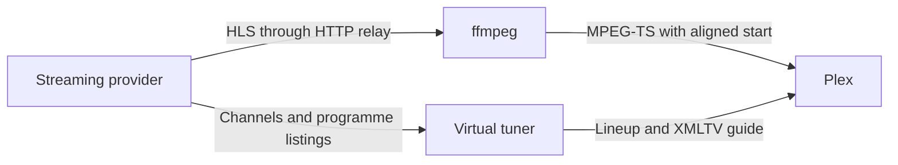

# Developing telesfor

[← Back to the README](../README.md)

For installation and command-line options, see the [usage guide](usage.md).

## How it works

telesfor presents each streaming provider as an HDHomeRun network tuner. Plex
reads `/discover.json` and `/lineup.json` for the device and channels, and
`/xmltv.xml` for the guide. Tuning a channel opens its `/stream/…` URL.

Each provider has a tuner of its own, with its own guide: TVP's at the root,
and the others at a path, such as `/globo`. Plex takes them as devices of one
DVR and shows a single channel list, sorted by number. So each tuner numbers
its channels in a range of its own, which keeps a provider's channels together.



| Package | Job |
|---|---|
| `internal/provider` | The contract every TV source implements. |
| `internal/provider/tvp` | TVP channels, guide and stream URLs. |
| `internal/provider/globo` | Globoplay's sign-in, channels, guide and stream URLs. |
| `internal/provider/ebc` | EBC's channels and streams, and TV Brasil's guide. |
| `internal/provider/cultura` | TV Cultura's channels, streams and guide. |
| `internal/store` | The bbolt database that keeps sign-ins across restarts. |
| `internal/remux` | HTTP relay, timestamp repair, ffmpeg stream copy and startup alignment. |
| `internal/tuner` | HDHomeRun emulation, streaming endpoints and the XMLTV guide. |
| `internal/web` | The settings page: Go templates, htmx and a stylesheet, built into the binary. |
| `cmd/telesfor` | Configuration, and a tuner for each provider. |

## Streaming details

### Why a relay?

Providers hand out stream URLs that only work from the address that asked for
them, so the stream must leave through the same proxy as the API calls.
ffmpeg fails to tunnel HTTPS through some HTTP proxies. The relay handles
upstream requests with the provider's HTTP client instead.

Each upstream server gets a loopback counterpart. ffmpeg reads from that
local address, and the relay fetches the same path from the real server.
Each provider can have its own proxy, headers or cookies without ffmpeg
needing to know about them.

### Why trim the start?

A stream with separate audio and video playlists, like TVP's, can begin with
a few seconds of video and no sound, and even one that begins with both
begins with video. Plex may give up with "Could not tune channel", or its
remux for the player may crash. telesfor passes ffmpeg's output on from the
first keyframe that the audio has started before, with that audio in front.
This usually drops the first segment of the head start.

### Why repair timestamps?

Some TVP streams stamp frames to be decoded after they are due on screen.
ffmpeg replaces those times with guesses, resulting in uneven playback.
The relay moves the decoding times of affected segments back into order
before ffmpeg reads them. Segments with valid timestamps pass through unchanged.

### Why start behind the live edge?

Live streams arrive a segment at a time. Small delays in finding each new
segment can leave Plex's player without enough data. telesfor joins six
segments behind the newest and sends those segments immediately, giving the
player a buffer. This is typically 12 seconds on TVP channels, or 24 seconds
on channels with longer segments, at the cost of that much live delay.

A playlist may hold less than that: TV Cultura's holds six seconds. Such a
stream starts later instead. telesfor holds it back until nine seconds of it
have come, so TV Cultura takes six to ten seconds to start.

## Adding a provider

Implement the four methods of `provider.Provider` in a package under
`internal/provider`:

```go
type Provider interface {
    Name() string
    Channels(ctx context.Context) ([]Channel, error)
    Programmes(ctx context.Context, channels []Channel, from, to time.Time) ([]Programme, error)
    Stream(ctx context.Context, channelID string) (Source, error)
}
```

Then give it a tuner in `cmd/telesfor/main.go`: a device ID, a path and a
range of channel numbers of its own, and the settings it is started with,
such as its proxy. Each stream returns a `Source` with its URL and the HTTP
client used to fetch it.

The tuner comes with a tab on the settings page, which shows those settings.
A provider adds to its tab by implementing more:

| Interface | Adds |
|---|---|
| `provider.Account` | A sign-in, by a code the user enters on the provider's own site. |
| `provider.Settings` | Settings of its own: HTML the provider writes, and the forms posted from it. |

The page allows no inline styles or scripts, so that HTML uses the classes of
`internal/web/static/style.css`.

## Tests

With ffmpeg installed, run:

```sh
go vet ./...
go test -race ./...
```

CI runs vet and tests with the race detector on every push, checks Go
formatting and scans for known vulnerabilities.

The tests use recorded responses. To check the providers against TVP's real
API, and the real sites and streams of EBC and TV Cultura, which CI does daily:

```sh
TELESFOR_LIVE=1 go test -count=1 -v -run TestLive \
  ./internal/provider/tvp ./internal/provider/ebc ./internal/provider/cultura
```

Globoplay's needs a telesfor that has signed in, stopped for the test, and a
Brazilian connection, so CI does not run it:

```sh
TELESFOR_LIVE=1 TELESFOR_DATA=<data directory> TELESFOR_GLOBO_PROXY='http://<proxy-host>:<port>' \
  go test -count=1 -v -run TestLive ./internal/provider/globo
```

To test the container image, which CI also does on every push:

```sh
docker build -t telesfor:smoke .
TELESFOR_SMOKE_IMAGE=telesfor:smoke go test -count=1 -run TestContainerServesLineup ./cmd/telesfor
```

To test the Linux packages, which CI does as well. It needs GoReleaser and
Docker:

```sh
goreleaser release --snapshot --clean --skip=nix
TELESFOR_SMOKE_DIST=$PWD/dist go test -count=1 -timeout 20m -run TestPackageService ./cmd/telesfor
```

## Releases

Push a tag that starts with `v`, such as `v0.1.0`. Once the checks pass, CI
builds the archives and packages with GoReleaser and publishes them as a
GitHub release, to the AUR and to the Homebrew, Scoop and Nix repositories,
then pushes the container image to `ghcr.io/combor/telesfor`.
