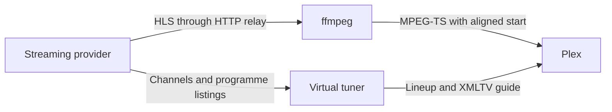

# Developing telesfor

[← Back to the README](../README.md)

For installation and command-line options, see the [usage guide](usage.md).

## How it works

telesfor presents each streaming provider as an HDHomeRun network tuner. Plex
reads `/discover.json` and `/lineup.json` for the device and channels, and
`/xmltv.xml` for the guide. Tuning a channel opens its `/stream/…` URL.

Each provider has a tuner of its own, with its own guide: TVP's at the root,
and the others at a path, such as `/globo`. Plex takes them as devices of one
DVR and shows a single channel list, sorted by number. So each tuner numbers
its channels in a range of its own, which keeps a provider's channels together.

Gathering a guide upstream can take minutes, which Plex is not made to wait:
each tuner fetches its guide ahead of time — at startup, when its channels
change and every six hours — and serves `/xmltv.xml` from that cache. While
the source is down, the guide it has goes on being served. Only a guide not
yet at hand, before the first fetch finishes or just after the channels
change, is fetched with Plex waiting.



| Package | Job |
|---|---|
| `internal/provider` | The contract every TV source implements, and helpers they share. |
| `internal/provider/tvp` | TVP channels, guide and stream URLs. |
| `internal/provider/globo` | Globoplay's sign-in, channels, guide and stream URLs. |
| `internal/provider/ebc` | EBC's channels and streams, and TV Brasil's guide. |
| `internal/provider/cultura` | TV Cultura's channels, streams and guide. |
| `internal/provider/francetv` | France Télévisions' channels, guide and stream URLs. |
| `internal/provider/tf1` | TF1+'s sign-in, channels, guide and stream URLs. |
| `internal/provider/wppilot` | WP Pilot's sign-in, channels, guide and stream sessions. |
| `internal/httpclient` | Connection pools that preserve the supplied HTTP transport settings. |
| `internal/store` | The bbolt database that keeps sign-ins across restarts. |
| `internal/remux` | HTTP relay, timestamp repair, ffmpeg stream copy, startup alignment and the choice of quality. |
| `internal/slowproxy` | A throttling proxy for trying telesfor on a slow connection. Not in the binary. |
| `internal/tuner` | HDHomeRun emulation, streaming endpoints and the XMLTV guide. |
| `internal/web` | The settings page: Go templates, htmx and a stylesheet, built into the binary. |
| `cmd/telesfor` | Configuration, and a tuner for each provider. |

## Streaming details

### Why a relay?

Providers hand out stream URLs that only work from the address that asked for
them, so the stream must leave through the same proxy as the API calls.
ffmpeg fails to tunnel HTTPS through some HTTP proxies. The relay handles
upstream requests with the provider's HTTP client instead.

Each upstream server gets a loopback counterpart. ffmpeg reads from that
local address, and the relay fetches the same path from the real server.
Each provider can have its own proxy, headers or cookies without ffmpeg
needing to know about them.

Audio and video segments use HTTP/1.1 so an abandoned fetch can close its
connection without holding up other responses on a shared HTTP/2 connection.
Completed fetches reuse connections. Adaptive playback keeps playlists, keys
and initialization sections on the provider's ordinary transport. The
passthrough relay uses HTTP/1.1 for all ffmpeg fetches, whose roles it does
not know in advance.

### Why trim the start?

A stream with separate audio and video playlists, like TVP's, can begin with
a few seconds of video and no sound, and even one that begins with both
begins with video. Plex may give up with "Could not tune channel", or its
remux for the player may crash. telesfor passes ffmpeg's output on from the
first keyframe that the audio has started before, with that audio in front.
This usually drops the first segment of the head start.

### Why repair timestamps?

Some TVP streams stamp frames to be decoded after they are due on screen.
ffmpeg replaces those times with guesses, resulting in uneven playback.
The relay moves the decoding times of affected segments back into order
before ffmpeg reads them. Segments with valid timestamps pass through unchanged.

### Why start behind the live edge?

Live streams arrive a segment at a time. Small delays in finding each new
segment can leave Plex's player without enough data. telesfor joins six
segments behind the newest and sends those segments immediately, giving the
player a buffer. This is typically 12 seconds on TVP channels, or 24 seconds
on channels with longer segments, at the cost of that much live delay.
France Télévisions' segments are the longest, at up to 46 seconds for the six.

A playlist may hold less than that: TV Cultura's holds six seconds. Such a
stream starts later instead. telesfor holds it back until nine seconds of it
have come, so TV Cultura takes six to ten seconds to start.

### Why change quality?

A stream that is too much for the connection arrives slower than it plays,
and the player runs dry. So a stream that comes in several qualities is played
in the best one the connection keeps up with.

ffmpeg cannot change quality within a stream. telesfor plays the stream in
legs instead: one ffmpeg per quality, each reading playlists that the relay
writes for it. To change, the relay ends the leg's playlists where ffmpeg has
got to. ffmpeg writes out what it has and stops, and the next one starts at
the following segment. What they write is joined into one MPEG-TS stream,
lined up by when frames are shown and with continuity counters carried on,
so Plex sees one stream whose picture changes size.

Two measures decide:

- **Speed.** Combined audio and video throughput during each video segment's
  fastest half second, in a quick and a slow moving average, of which the
  lower counts. The whole transfer tells too little: it starts slowly on a
  connection that was idle, and EBC hands out its newest segment in three
  seconds where older ones take a quarter of one. The speed is remembered
  per provider for ten minutes, and what other streams of the provider take
  is taken off.
  A segment's remaining download time is estimated from its own rate.
- **Reserve.** An estimate of what the player has in hand: the stream sent,
  less the time since it went on air, less the five seconds Plex holds back.

| Decision | Rule |
|---|---|
| Start | With a remembered speed: the best quality whose average rate is within 70% of it. Either way, the first segment is the test: if after half a second it comes slower than its quality plays, the stream starts over in the best quality within 50% of the speed seen. Nothing has been sent by then. |
| Step down | When segments take longer to arrive than to play: the last six together while over two thirds of the reserve are left, two in a row below that, a single one under a third. A segment counts as soon as it has taken that long, arrived or not. One that looks like arriving after the reserve has run out, for a tenth of the reserve, is given up and fetched in the lower quality. |
| To where | The best quality within 80% of the speed, or within 50% when a segment was given up or under a third of the reserve is left. |
| Step up | One quality at a time: when the stream has caught up with the provider's newest segment, which is when the reserve is back, the next quality is within 70% of the speed, and nothing has arrived slowly or changed for 30 seconds or six segments. |
| After a step up | One that is taken back within 30 seconds or six segments is not tried again for two minutes, then four, up to thirty. |
| A quality that will not play | The stream goes on in the quality it had, or in the best if it had none, and leaves that quality alone for two minutes, then four, up to thirty. |

The shares leave room for the speed to vary and for segments larger than the
average, which the reserve also covers: TVP's take up to half as much again.
Waiting on a step up, and longer after a failed one, keeps the quality from
going back and forth.

Only slow segments change the quality. A provider that fails, or a viewer that
is slow to read, also shrinks the reserve, but no other quality would help.

What to keep in mind:

- The reserve is reckoned, not read from Plex's player.
- A change of resolution reaches Plex in the stream itself. A client that
  cannot follow one needs Plex to transcode.
- A step up at the live edge waits for the ffmpeg before it to stop, up to
  half a target duration, which the reserve pays once.
- The way back up takes 30 seconds or six segments a step: about three
  minutes from the lowest quality to the best on France Télévisions.
- A stream that starts on a slow connection may stall once in its first
  seconds, while the head start is still arriving.
- A provider that is slow to hand out a segment looks like a slow connection.
  EBC is at times, and the quality then dips for a minute or two.
- A stream of one quality is played as before, and not measured.

## Adding a provider

Implement the four methods of `provider.Provider` in a package under
`internal/provider`:

```go
type Provider interface {
    Name() string
    Channels(ctx context.Context) ([]Channel, error)
    Programmes(ctx context.Context, channels []Channel, from, to time.Time) ([]Programme, error)
    Stream(ctx context.Context, channelID string) (Source, error)
}
```

Each stream returns a `Source` with its URL and the HTTP client used to fetch
it. A client whose requests need changing, to name a browser or to carry a
pass, wraps the provider's transport with `httpclient.Wrap`, so that its
segments keep their own connections. A stream whose addresses carry a pass
that runs out keeps it good with `provider.Pass`.

Package `provider` has the helpers that providers share. A guide with gaps
fills them with `provider.Fill`, which puts in the channel's name an hour at a
time: Plex offers a channel by what is on it, so a gap would leave nothing to
pick. A guide that gives only start times ends its programmes with
`provider.UntilNext`.

A provider names itself once in its errors: its helpers leave the name out,
and each exported method puts it in front, as in `tvp: listing channels: …`.

Then add a row for it to `sources` in `cmd/telesfor/main.go`. The row has a
key, which names the `-<key>-proxy` flag and `TELESFOR_<KEY>_PROXY`, and says
for `-help` what the provider is and why it may want a proxy. `proxied` opens
the provider with its proxy, or `stored` with the store as well, for one that
keeps a sign-in. The row's tuner has a device ID, a path and a range of
channel numbers of its own, which Plex knows it by, so they stay as they are.
It also says how many streams the provider plays at once, if fewer than four.

The tuner comes with a tab on the settings page, which shows its proxy. A
provider that implements `provider.Account` also has its sign-in there, by a
code the user enters on the provider's own site. It keeps the account across
restarts with `store.Get`, `store.Put` and `store.Delete`, in a bucket named
for it.

Beyond its package and `main.go`, a provider is written up by hand in:

- `README.md`: a line of *What you get*, the region note if it needs a
  connection in its own country, and a row of the *Connect Plex* table.
- `docs/usage.md`: a *Configuration* row for its proxy, and a section of its
  own. With a sign-in, also the *Web interface* sentence on signing in and a
  *Troubleshooting* row.
- This page: a row of the package table, and with a sign-in, how to run its
  live test.
- `packaging/linux/telesfor.env`: its proxy, commented out, with the others
  of its country.
- Its package: a `TestLive`, which CI runs daily with the others.

## Tests

With ffmpeg installed, run:

```sh
go vet ./...
go test -race ./...
```

CI runs vet and tests with the race detector on every push, checks Go
formatting and scans for known vulnerabilities.

To see how the choice of quality fares on simulated connections, against
always playing the best:

```sh
go test -v -run TestAdaptation ./internal/remux
```

To try it on a real connection, put the throttling proxy in front of a
provider, and change its rate as the stream plays:

```sh
go run ./internal/slowproxy -rate 20M
./telesfor -tvp-proxy http://127.0.0.1:8899
curl 'http://127.0.0.1:8899/rate?to=3M'
```

The tests use recorded responses. To check the providers against the real
APIs of TVP and France Télévisions, the real sites and streams of EBC and
TV Cultura, and TF1's guide and LCI, which CI does daily:

```sh
TELESFOR_LIVE=1 go test -count=1 -v -run TestLive \
  ./internal/provider/tvp ./internal/provider/ebc ./internal/provider/cultura \
  ./internal/provider/francetv ./internal/provider/tf1
```

Globoplay's needs a telesfor that has signed in, stopped for the test, and a
Brazilian connection, so CI does not run it:

```sh
TELESFOR_LIVE=1 TELESFOR_DATA=<data directory> TELESFOR_GLOBO_PROXY='http://<proxy-host>:<port>' \
  go test -count=1 -v -run TestLive ./internal/provider/globo
```

TF1+'s other channels need the same, with a French connection:

```sh
TELESFOR_LIVE=1 TELESFOR_DATA=<data directory> TELESFOR_TF1_PROXY='http://<proxy-host>:<port>' \
  go test -count=1 -v -run TestLive ./internal/provider/tf1
```

WP Pilot's needs the same, with a Polish connection. It opens three
channels, which WP Pilot counts as changes of channel:

```sh
TELESFOR_LIVE=1 TELESFOR_DATA=<data directory> TELESFOR_WPPILOT_PROXY='http://<proxy-host>:<port>' \
  go test -count=1 -v -run TestLive ./internal/provider/wppilot
```

To test the container image, which CI also does on every push:

```sh
docker build -t telesfor:smoke .
TELESFOR_SMOKE_IMAGE=telesfor:smoke go test -count=1 -run TestContainerServesLineup ./cmd/telesfor
```

To test the Linux packages, which CI does as well. It needs GoReleaser and
Docker:

```sh
goreleaser release --snapshot --clean --skip=nix
TELESFOR_SMOKE_DIST=$PWD/dist go test -count=1 -timeout 20m -run TestPackageService ./cmd/telesfor
```

## Releases

Push a tag that starts with `v`, such as `v0.1.0`. Once the checks pass, CI
builds the archives and packages with GoReleaser and publishes them as a
GitHub release, to the AUR and to the Homebrew, Scoop and Nix repositories,
then pushes the container image to `ghcr.io/combor/telesfor`.
